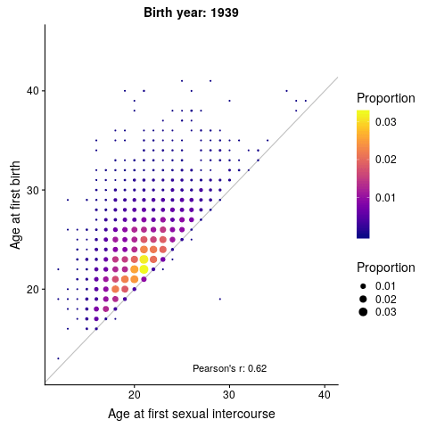

This repo contains visualizations of the univariate and joint distributions of the [age at first birth](https://biobank.ndph.ox.ac.uk/showcase/field.cgi?id=2754) and [age at first sexual intercourse](https://biobank.ndph.ox.ac.uk/showcase/field.cgi?id=2139) variables in the UK Biobank, by year of birth, that I created as part of the HRB2 GWAS, while working on the [SOCIOGENOME project](https://www.sociogenome.org/) at the [Leverhulme Centre for Demographic Science](https://www.demographicscience.ox.ac.uk/). Here is an example (static version [here](figs/afb_afs_corr_plt.pdf)):

